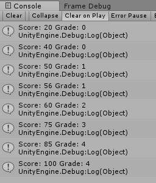
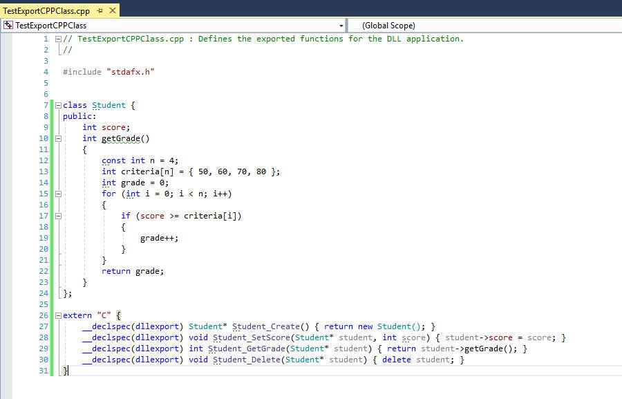
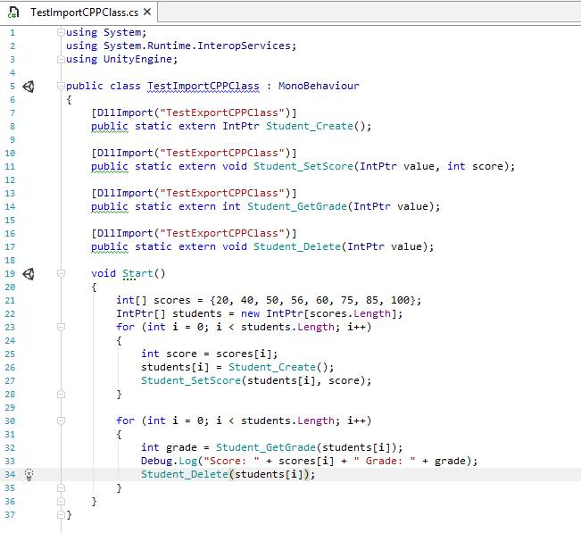
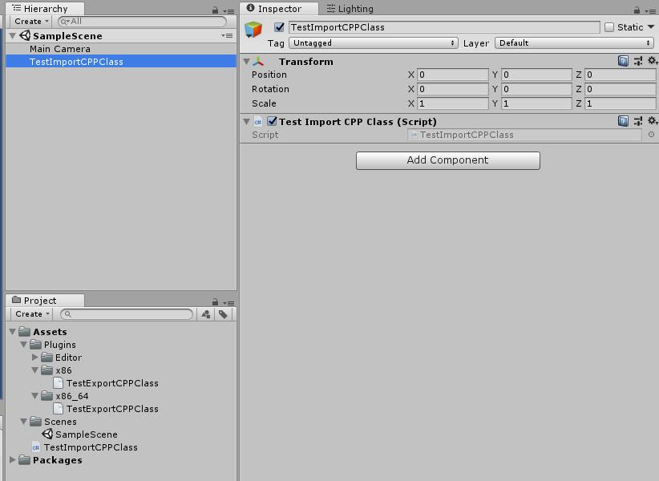

# UnityCPPClassDLLExample

Example exporting CPP class as DLL and importing in Unity as native plugin

## How to run NOW

Open Unity project `TestImportCPPClass` and press Play button or Ctrl+P. You will see the output is being printed in the console.

## How to reproduce result from scratch

1. Open Visual Studio 2017 and create a new DLL project.
2. Copy content of file `TestExportCPPClass.cpp` from `TestExportCPPClass/TestExportCPPClass/` directory.

    
3. Go to Build -> Build solution, make sure the build is set to x64 to get a
    `dll` file ready for Unity project with x64 architecture.
    (Optional: You could also build x86 version too)
4. Create a new Unity project.
5. Copy `dll` file from `TestExportCPPClass/x64/Debug` into Unity's `Assets/Plugins/x86_64` directory.
6. Open Unity project and copy the C# script from `TestImportCPPClass/Assets/` directory.

    
7. Create an empty GameObject in the scene and attach the script to it.

    
8. Press Play button to see the output in the console.

    

## Related resources

<https://stackoverflow.com/questions/315051/using-a-class-defined-in-a-c-dll-in-c-sharp-code/315064#315064>

<https://github.com/wm4n/unity-cpp-lib>

<https://github.com/Meach/UnitySimpleNativeLibrary>